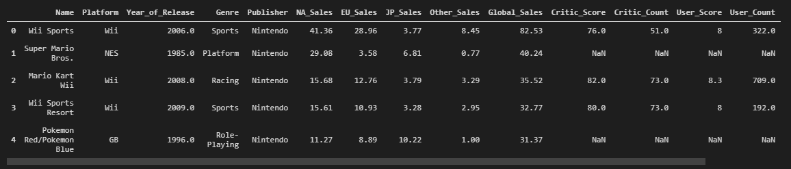
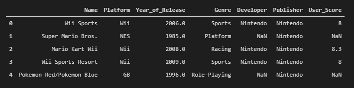
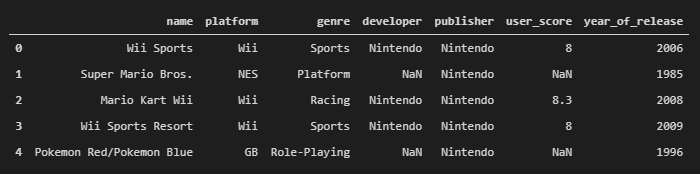
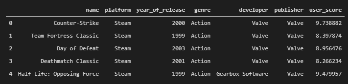
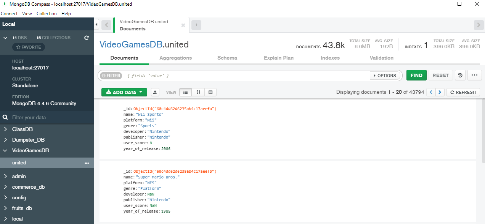
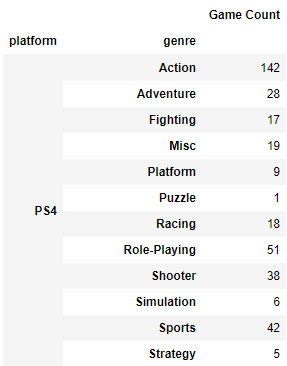

# ETL Project
## Extract, Transform and Load videogames data

### Contributors
* Edoardo Zapata
* Juan Francisco Camberos
* Raúl Maya
* Ricardo Pérez
* Salvador del Cos Garza

### Project Description/Outline

The scope of this project was to extract data from different data sources, clean and transform them and load them into a database in order to solve specific queries. This project was developed using Python, Pandas, MongoDB and PyMongo. Data was retrieved from two sources: [dataworld.com](https://data.world/sumitrock/videogames) for Console videogames and [kaggle.com](https://www.kaggle.com/nikdavis/steam-store-games) for Steam videogames.

**Project Report**
* https://docs.google.com/document/d/1nvgadoA2MatHyb9iYDkm12OfAQX9vca38SyVaIQAQ4U/edit?usp=sharing

### WorkFlow

#### 1. Extract Data
Datasets were downloaded in CSV format and then imported into Pandas DataFrame: 

| Raw data for Console & Steam games |
| --- |
|  |
|  |

#### 2. Transformed Data
After exploring raw data, datasets were cleaned and formatted (select relevant fields, cast types, compute missing fields, rename columns, etc.): 

| Clean data for Console & Steam games |
| --- |
|  |
|  |

#### 3. Load Data
The team decided to use a NoSQL Database (MongoDB) as the best fit since the data gathered had relevant fields with mixed types (int, NaN, str). Both datasets were loaded in the same collection in order to solve queries.

| MongoDB `united` collection |
| --- |
|  |

### Example Query
**"Number of games for preferred platforms, grouped by genre"**

* A query was built using PyMongo to find all the games for a defined set of preferred platforms: (PS4, Xbox One & Steam). The query results were stored in a DataFrame.
* Considering PS4 and Xbox One release dates, the DataFrame was filtered for games released between 2014 and 2016.
* Finally, the number of games for each of the defined platforms -by genre- was obtained using `groupby`.

| Example Query (PS4 slice) |
| --- |
|  |

